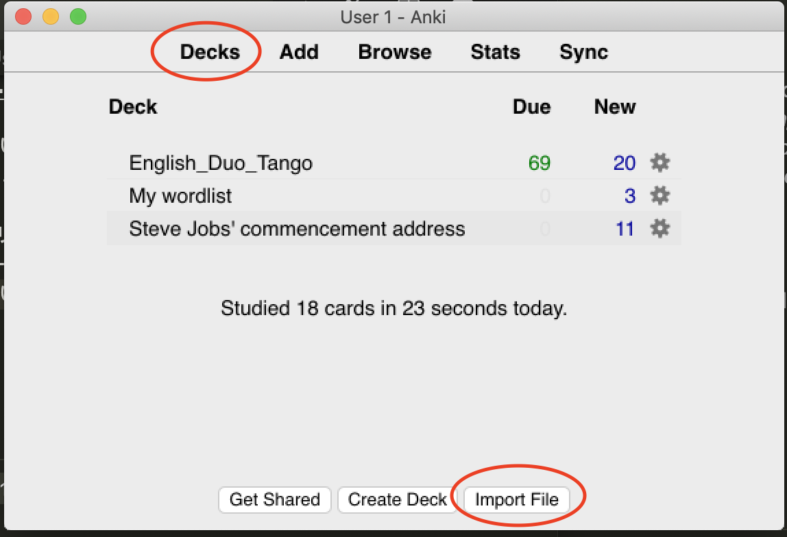

weblio_uwl2csv
===

# Usage

1. https://uwl.weblio.jp/word-list にアクセスして単語帳を開きます。

2. [index.js](./index.js)のコードをコピーしてdevToolsを開いてconsoleタブを開きます。ペーストして実行します。

3. 適当にテキストエディタを開いてペーストして拡張子をcsvにして保存します。
  - 前手順のスクリプト実行により`${単語}, ${意味}`でクリップボードにコピーされます
4. Anki.appを開いてDecks->Import Filesをクリックします

5. 作成したcsvファイルを選択してOpenをクリック

6. Deckなどを選択してImportをクリックします

